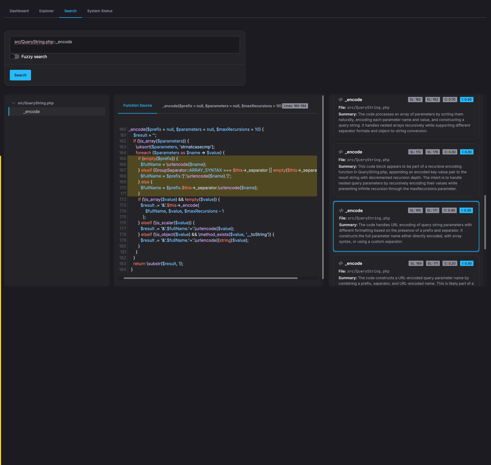
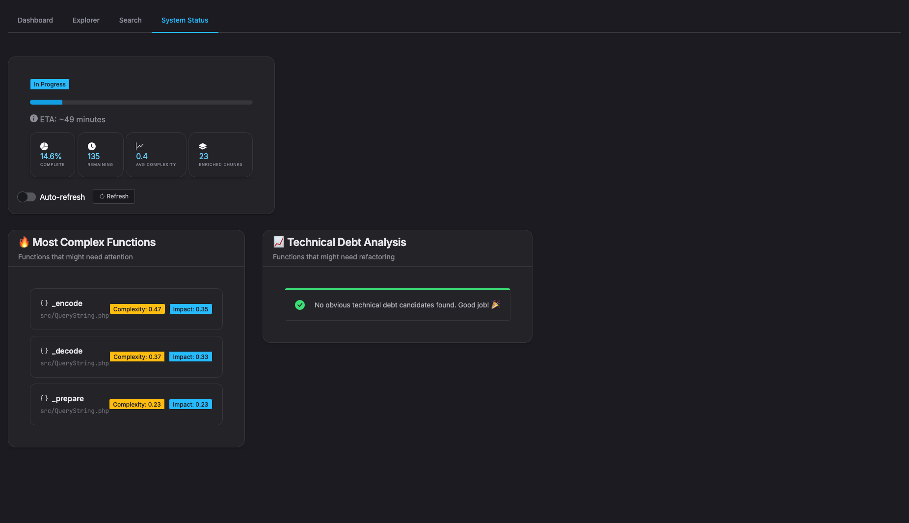

# 🧠 SemanticStack

**SemanticStack** is a full-stack, modular system for **semantic enrichment, embedding, and similarity search**. It lets you transform raw input (text, logs, code, etc.) into enriched, queryable meaning using:

- Python-based LLM pipelines
- PostgreSQL with vector search (via pgvector)
- A Vite-powered frontend
- Docker Compose for orchestration
- Bash scripts for workflow automation

---

## 🏗 Architecture Overview

```plaintext
[Frontend (Vite)]  <-->  [API Backend (FastAPI/Flask?)]  <-->  [Enricher (LLM)]  <-->  [Postgres + pgvector]
                                      |
                                [LM Studio (Optional)]
```

---

## 📁 Project Structure

```bash
.
├── docker-compose.yaml         # Orchestrates Postgres, API, Frontend, etc.
├── setup.sh                    # Initial setup helper
├── api/
│   └── src/
│       └── main.py             # Backend routes and logic
├── python-enricher/
│   └── src/
│       ├── config.py           # Runtime config (vector dim, model path)
│       └── enricher.py         # Core LLM-based summarization + embedding
├── frontend/
│   ├── Dockerfile              # Frontend container
│   ├── index.html              # Root HTML
│   ├── vite.config.js          # Vite config
│   ├── package.json            # Frontend dependencies
│   └── src/
│       ├── main.js             # App logic
│       └── styles.css          # Styling
└── scripts/
    ├── dev.sh                  # Spin up dev stack
    ├── prod.sh                 # Spin up prod stack
    ├── enrich.sh              # Run enrichment
    ├── full-pipeline.sh        # End-to-end pipeline (ingest → enrich → embed)
    ├── migrate-to-768.sh       # Adjust vector size
    ├── setup-lm-studio.sh      # Prepare LM Studio
    └── ...                     # Monitoring / misc utilities
```

---

## 🚀 Getting Started

### Prerequisites
- Docker + Docker Compose
- Python 3.10+
- LM Studio (optional, for local LLM inference)
- Node.js (if modifying frontend)

### One-liner Setup

```bash
chmod +x setup.sh
./setup.sh
docker-compose up --build
```

This will launch:
- PostgreSQL with pgvector
- The Python API backend
- The Vite frontend
- Support scripts for enriching and managing data

---

## 🔍 Semantic Enrichment

- Raw data is processed via `python-enricher/src/enricher.py`
- Generates:
  - A natural language summary
  - A vector embedding
  - Optional metadata tags
- Vector + metadata are stored in PostgreSQL via the backend API

---

## 🌐 Frontend

Accessible via [http://localhost:5173](http://localhost:5173)

Features:
- Semantic query input
- Visualization of matched results
- Lightweight, responsive layout






---

## 🧪 CLI & Pipeline Scripts

```bash
./scripts/full-pipeline.sh       # Full ingest → enrich → embed pipeline
./scripts/enrich.sh input.txt    # Enrich custom input
./scripts/status.sh              # Health check on services
./scripts/migrate-to-768.sh      # Resize embeddings (e.g., for new model)
```

---

## 📊 PostgreSQL & Embeddings

Relies on:
- `pgvector` or `pg_embedding` extension
- Tables for:
  - documents
  - embeddings
  - enrichment metadata

Use cosine similarity or inner product for nearest-neighbor search.

---

## 🧠 LM Studio Integration

To run local embeddings/summaries:

```bash
./scripts/setup-lm-studio.sh
./scripts/test-lm-studio.sh
```

Configure model path and endpoint in `python-enricher/src/config.py`.

## 📜 License

MIT

---


Example code from PapayaCMS (Content Management System and web application framework)
[PapayaCMS](https://github.com/papayaCMS/papayacms-core/tree/master)

